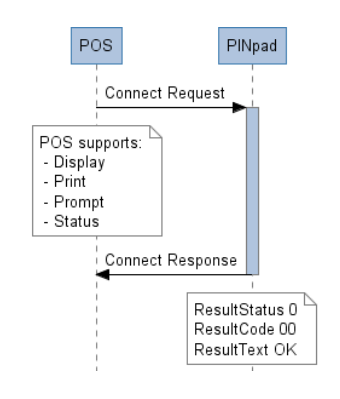
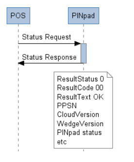
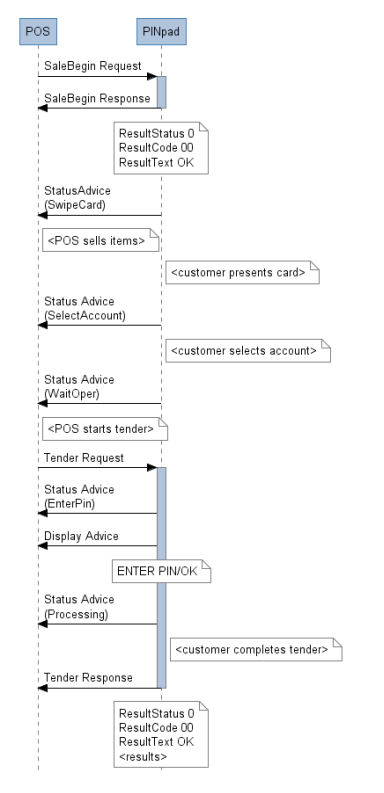

# Implementation Overview
## What do I do now?

You have been given this document and a contact at Quest who is your point of contact for any 
questions you have during your implementation. The first thing to do is to review this document in its 
entirety and formulate a list of questions for the things you do not understand. You should then 
forward this list to your Quest contact, preferably by email, who will organise a response to your 
queries. When you are ready to begin contact Quest to obtain an SDK from Quest which includes a 
PINpad and the software required for you to test your interface.

Now, follow this section through as it leads you through implementing the interface.

## Connecting the PINpad
Your starting point is to connect the PINpad to your development system and check that it is working. 
Plug the PINpad communications cable into your PC Serial or USB port. Also plug in the power supply 
if one was provided. The PINpad should make an ascending beep noise a few seconds after it is 
powered up. If it fails to power up, check all the connections and that the power outlet works.

## Write a Communications layer

Have a clear understanding of the architecture you need to implement. The communications layer is 
the backbone of the system you are implementing and it is vital that it is written correctly. Give 
consideration to what information you will log. Remember that you will want different levels of 
information logging for development, pilot and rollout and you will want to readily switch between 
them. An issue in a remote site will be more quickly resolved if you have the ability to enable detailed 
logging of time stamped data, presented in a readable format.

For both POS Terminal and POS Server models the communications to the PINpad is XML over TCP/IP
and the connection from the POS should be made at application startup and re-established whenever 
the socket drops. 

### POS Terminal Model Communications
For POS Terminal Model the POS software needs to establish a TCP connection to the IP address the 
Wedge is running on (for example 127.0.0.1 if the POS and Wedge are running on the same PC), port 
7100. 

## Implement the ConnectRequest

Refer to section ConnectRequest and ConnectResponse for the message format details.
The first thing the POS must do on creating (or re-establishing) the socket connection to the 
Wedge/PINpad is to send a ConnectRequest message. This message is mandatory and identifies the 
POS instance to Cloud EFTPOS and defines the type of functionality the POS has implemented by 
selecting the types of messages the POS is subscribing to. This, in turn, directs the Wedge to 
enable/disable certain messages from the PINpad-POS exchange.

For example, a POS might wish simply to start an EFT tender and do nothing more until the tender is 
complete and the result is available. This type of implementation involves one ‘TenderRequest’ 
message and one ‘TenderResponse’ message to perform EFT tenders. It is very rare that a POS would 
implement in this way and Quest must be consulted first before heading down this path because the 
POS system will not support several important features such as Signature verification or Offline / over 
limit transactions. 

The standard implementation is for a POS to subscribe to Display, Print and Prompt messages in the 
ConnectRequest. This way the POS has more control over the tender process showing display prompts 
to the operator, printing EFT signature verification receipts, and prompting for signature verification.

Even for Administration functions it is strongly recommended that the POS subscribe to Display, Print
and Prompt messages in the ConnectRequest and print the receipts as the PrintRequests are received 
from the PINpad. The reason being that some functions, such as Print Shift Totals, will print 
information and prompt to reset the totals. The operator is expected to check that the totals were 
printed without a problem (like out of paper in the printer) before saying “YES” to reset the totals. If 
the POS doesn’t subscribe to prints then the operator cannot verify that the totals are printed correctly 
before initiating a reset of the totals to complete the function.

After sending the ConnectRequest message, the POS must wait for the corresponding 
ConnectResponse message and process the result. A failure result means that the EFT system is not 
available.

  

## Implement the Status Enquiry Function
Refer to sections StatusRequest and StatusResponse for the message format details.

Status enquiry is a good first function to implement because it responds straight away with a status 
enquiry response and there are no other messages to handle in between the request and response.

The StatusRequest message may be used to check that the PINpad is connected and functioning. The 
POS can use it to indicate to the POS operator if EFT is available or not, although this is not 
recommended for Central POS Model. The PINpad’s details are returned in the corresponding 
StatusResponse message.

  

## Implement EFT Tender
The EFT Tender function requires a number of messages to be implemented.

### Starting and Ending a POS Sale
Refer to sections SaleBeginRequest / SaleBeginResponse and SaleEndRequest/ SaleEndResponse for 
the message format details.

These messages are used to indicate the beginning and end of a POS sale transaction and optionally 
to enable/disable the pre-swipe feature of the PINpad during the POS sale. The SaleBeginRequest is 
to be sent as soon as the POS starts a new Sales Transaction and wants a customer to begin the preswipe EFT process on the PINpad. Typically this is when the first item is added to a Sale on the POS. 

When enabled, pre-swipe allows a customer to present their card whilst the POS is still ringing up item 
sales – prior to the POS tender process. Then, when the POS subsequently sends the tender request, 
the card details are already available, saving some time at the checkout. The pre-swipe mode is 
automatically terminated when the first tender completes. After sending the SaleBeginRequest
message the POS must wait for the corresponding SaleBeginResponse message from the PINpad. This 
exchange is to complete before the POS enters the Tender process.

Once the Sale is completely tendered off, regardless of whether any tenders were EFT or not, the POS 
must then send a SaleEndRequest and wait for the corresponding SaleEndResponse message. The 
SaleEndRequest will ensure any unused pre-swipe EFT or loyalty details on the PINpad are cleared.

  

### Starting an EFT Tender

Refer to sections TenderRequest / TenderResponse for the message format details.
The TenderRequest message is used to start an EFT tender payment. The POS issues the request and 
then waits for the corresponding TenderResponse message, processing any intermediate display, print and prompt messages from the PINpad. The tender result is contained in the response message, 
together with additional details from the bank, including the receipt.
Depending on the options configured by the POS in the ConnectRequest, the Wedge may send some 
or all of the following messages between the TenderRequest and the TenderResponse:

- DisplayAdvice
- PrintRequest
- CardCheckRequest
- PromptRequest
- StatusAdvice

If the POS receives any of these messages it must process them, including sending back any relevant 
‘response’ messages and then continue to wait for the underlying TenderResponse message to 
indicate the completion of the tender.

Whilst waiting for the tender to complete the POS may also send either the CancelRequest or 
ManualEntryAdvice message to the PINpad to alter the processing flow: the CancelRequest asks the 
PINpad to cancel the current tender (which may or may not be permitted depending at which point 
during the transaction the request is received) and the ManualEntryAdvice is to be used when the 
PINpad MSR fails to read the card and the POS wishes to capture the card number via manual entry of 
the card number embossed on the front of the card. Manual entry itself is performed on the secure 
PINpad device (not the POS).

**Note: Before implementing pre-authorisation and completion transactions, contact your Quest 
representative to discuss the details of the implementation.**
